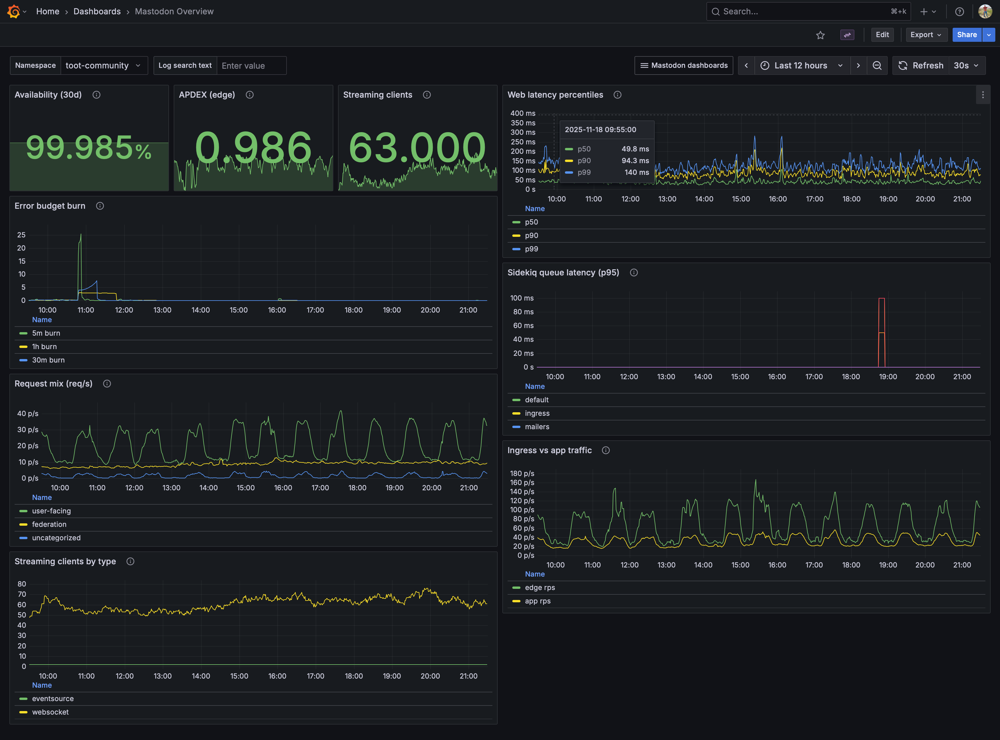
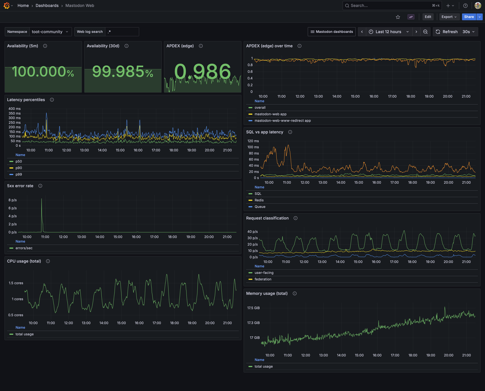
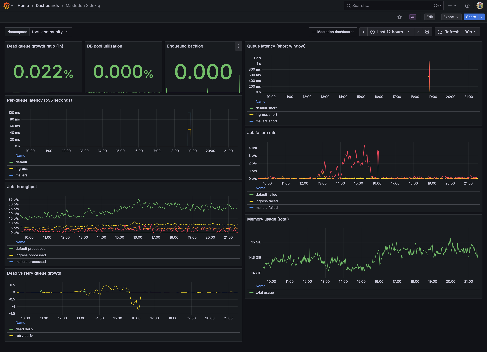
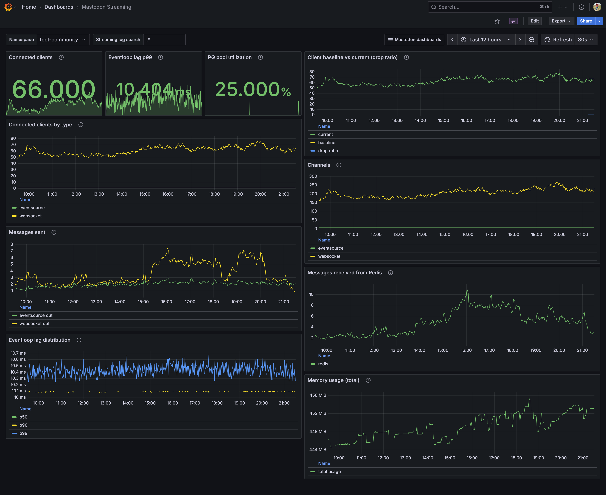
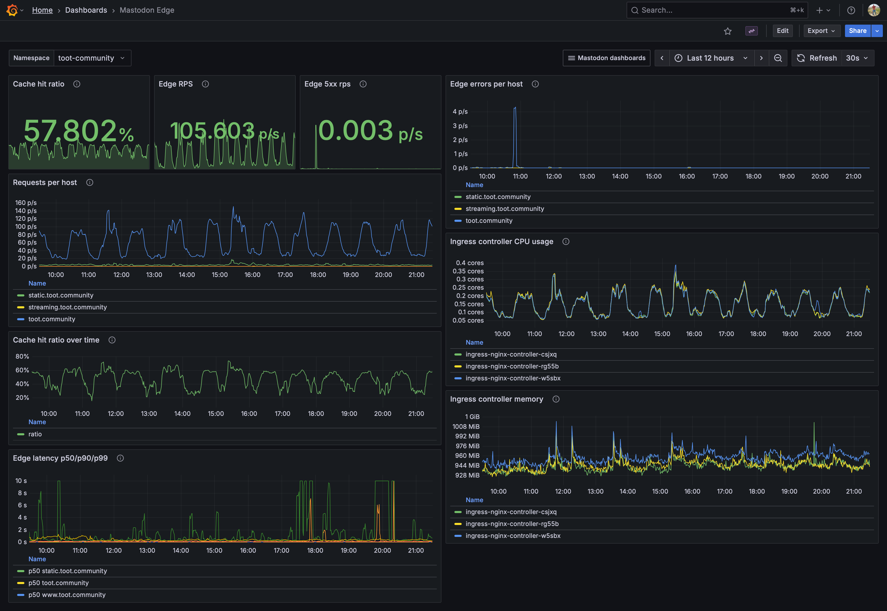

# Mastodon Observability (toot.community)

This repository contains the Jsonnet/Grafonnet code that powers observability for the toot.community Mastodon instance. It is published as a reference for how we run monitoring in production.

- Instance: https://toot.community
- Questions: [@jorijn](https://toot.community/@jorijn) or [@support](https://toot.community/@support)

## What's inside
- **Jsonnet libraries** for recording/alerting rules and Grafana dashboards under `lib/mastodon/`.
- **Dashboards** for web, sidekiq, streaming, edge/ingress, and an overview (`lib/mastodon/dashboards/*.libsonnet`).
- **Recording rules & alerts** (`lib/mastodon/records.libsonnet`, `lib/mastodon/alerts.libsonnet`) keyed by `namespace` so a single set covers both toot.community and microblog.network (our testing instance).
- **Config** in `lib/mastodon/config.libsonnet` (SLO targets, ingress APDEX thresholds, Sidekiq queues/latency windows, request classification).
- **Runbooks** in `docs/runbooks/` linked directly from alert annotations.
- Inspiration: Google SRE handbook/playbook patterns (multi-window burn rates, symptom-based alerts).

## Stack requirements
- VictoriaMetrics (Prometheus-compatible) for metrics.
- Grafana with provisioning of dashboards via ConfigMaps (see `deploy/kustomization.yaml`).
- PrometheusRule-compatible operator (vmalert/VM operator in our case).
- Tooling to render: `jsonnet`, `jsonnetfmt`, `jsonnet-lint`, `promtool`, `kustomize`, `kubectl`.

### Mastodon deployment assumptions

- **Ingress**: We front Mastodon with ingress-nginx (standard controller). Edge metrics/APDEX rely on nginx-ingress histogram buckets.
- **Prometheus exporter settings**: (see [Mastodon docs](https://docs.joinmastodon.org/admin/config/#prometheus))
  - Generic env (web/sidekiq/streaming):
    - `MASTODON_PROMETHEUS_EXPORTER_ENABLED="true"`
    - `MASTODON_PROMETHEUS_EXPORTER_WEB_DETAILED_METRICS="true"`
    - `MASTODON_PROMETHEUS_EXPORTER_SIDEKIQ_DETAILED_METRICS="true"`
    - `PROMETHEUS_EXPORTER_HOST="127.0.0.1"`
    - `PROMETHEUS_EXPORTER_PORT="9394"`
  - Sidekiq env overrides (runs exporter inside the worker Pod):
    - `MASTODON_PROMETHEUS_EXPORTER_ENABLED="true"`
    - `MASTODON_PROMETHEUS_EXPORTER_LOCAL="true"`
    - `MASTODON_PROMETHEUS_EXPORTER_HOST="0.0.0.0"`
    - `MASTODON_PROMETHEUS_EXPORTER_PORT="9394"`
- **Web exporter sidecar**: Mastodon web Pods run a sidecar container using the same Mastodon image executing `./bin/prometheus_exporter` (our Helm chart handles this; see [toot-community/platform](https://github.com/toot-community/platform/tree/main/charts/mastodon)).
- **Logging**: Vector ships Pod logs to VictoriaLogs; dashboards assume fields like `_msg`, `kubernetes.pod_namespace`, and `kubernetes.pod_name`.
- **Scraping**: VictoriaMetrics scrapes the exporters on all Mastodon Pods, as well as ingress-nginx metrics.

If you deploy Mastodon differently (other ingress, disabled exporters, etc.) you'll need equivalent metrics/logs to drive these dashboards.

## Generate / lint / apply
```sh
make generate          # render to generated/
make lint              # format + jsonnet-lint + promtool check rules
make apply             # kustomize build deploy | kubectl apply -f - (namespaced to mastodon-observability)
```

## Data sources & SLOs (high level)
- **Web**: `ruby_http_requests_total` + duration summaries for diagnostics; availability/SLI excludes federation controllers; edge-based APDEX from ingress histograms (100/500ms, 5xx frustrated).
- **Sidekiq**: queue latency, processed/failed rates, dead/retry growth, DB pool utilization.
- **Streaming**: connected clients, Redis/PG pools, eventloop lag, messages in/out.
- **Edge/Ingress**: nginx-ingress RPS/errors/latency, estimated cache hit ratio (no alerts).

### SLOs we hold ourselves to
- **Web availability**: We aim for 99.5% success on user-facing requests, with alerts that escalate when the error budget is burning fast or steadily.
- **Web latency / APDEX**: We expect most requests to feel fast (target APDEX around 0.90+ using 100/500ms thresholds); if p99 latency climbs above 1s during real traffic, we treat it as critical.
- **Sidekiq**: Background queues should stay responsive; if queue latency rises or the dead queue grows unusually versus processed jobs, we investigate.
- **Streaming**: Connected clients and delivered messages should stay near recent norms; large drops trigger alerts, as does sustained event loop lag.

## Usage and support
This code is tailored for toot.community and published as a reference. You're welcome to borrow ideas and adapt it; use `lib/mastodon/config.libsonnet` to tune namespaces, SLOs, and thresholds for your environment. Feel free to say hi ([@jorijn](https://toot.community/@jorijn) or [@support](https://toot.community/@support)), but we don't promise support beyond sharing how we run it.

## Screenshots






## License
MIT License — see `LICENSE`. Use at your own risk; attribution appreciated.
